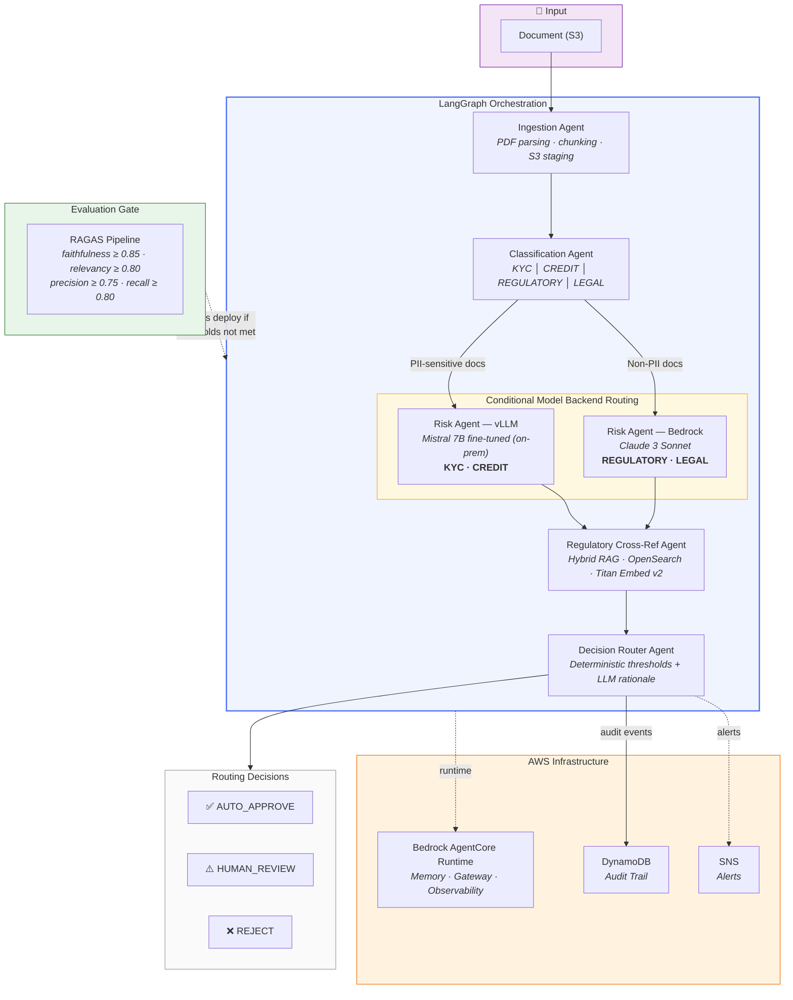

# Fintech Agentic AI System
### Multi-Agent Document Intelligence with AWS Bedrock AgentCore · LangGraph · vLLM · RAGAS

[](evaluation/ragas_eval.py)
[](infrastructure/agentcore/)
[](LICENSE)

> Companion repository for the LinkedIn article:  
> **"Beyond Chatbots: Building Production-Grade Agentic AI Systems for Fintech"**  
> by Anirban Bose · AWS AIP-C01 Early Adopter · Senior Principal AI Architect

---

## What This System Does

A production-grade, five-agent document intelligence pipeline for financial services:

1. **Ingestion Agent** — Parses PDFs, chunks intelligently, stages to S3
2. **Classification Agent** — Routes documents: `KYC | CREDIT | REGULATORY | LEGAL`
3. **Risk Analysis Agent** — Scores risk (0.0–1.0) via fine-tuned Mistral 7B on-prem or Bedrock
4. **Regulatory Cross-Reference Agent** — Flags compliance gaps via hybrid RAG over regulatory corpus
5. **Decision Router Agent** — Aggregates signals → `AUTO_APPROVE | HUMAN_REVIEW | REJECT`

Every decision is logged to DynamoDB with a full audit trail suitable for regulatory inspection.

---

## Architecture



**Model Backend Routing:**
- `KYC` and `CREDIT` documents → self-hosted Mistral 7B (vLLM, private VPC — no PII leaves the network)
- `REGULATORY` and `LEGAL` documents → AWS Bedrock Claude 3 Sonnet

---

## Tech Stack

| Layer | Technology |
|-------|-----------|
| Orchestration | LangGraph |
| Execution runtime | AWS Bedrock AgentCore Runtime |
| LLM (cloud) | Claude 3 Sonnet / Haiku (Bedrock) |
| LLM (on-prem) | Mistral 7B fine-tuned (vLLM) |
| Model proxy | LiteLLM (OpenAI-compatible routing) |
| Fine-tuning | QLoRA / 4-bit quantization |
| RAG vector store | Amazon OpenSearch Serverless |
| Embeddings | Amazon Titan Embed v2 |
| Evaluation | RAGAS (faithfulness · relevancy · precision · recall) |
| Storage | S3 · DynamoDB |
| Alerting | Amazon SNS |

---

## Repository Structure

```
fintech-agentic-system/
├── agents/
│   ├── ingestion_agent.py          # PDF parsing + S3 staging
│   ├── classification_agent.py     # Document type router (Bedrock)
│   ├── risk_agent_bedrock.py       # Risk scoring via Bedrock
│   ├── risk_agent_vllm.py          # Risk scoring via self-hosted vLLM
│   ├── regulatory_agent.py         # Hybrid RAG over regulatory corpus
│   └── decision_router.py          # Signal aggregation + routing
├── orchestration/
│   ├── graph.py                    # LangGraph state machine
│   ├── state.py                    # TypedDict state schema
│   └── runner.py                   # Execution + HITL + error handling
├── evaluation/
│   ├── ragas_eval.py               # RAGAS evaluation pipeline + deployment gate
│   ├── golden_dataset/             # 500-example golden evaluation set
│   └── thresholds.py              # Configurable pass/fail thresholds
├── infrastructure/
│   ├── agentcore/
│   │   ├── runtime_config.yaml    # AgentCore Runtime definition
│   │   └── memory_config.yaml     # Memory scoping policy
│   ├── vllm/
│   │   ├── docker-compose.yml     # vLLM + LiteLLM proxy stack
│   │   └── litellm_config.yaml   # Model routing rules
│   └── terraform/                 # IaC for full AWS stack
├── fine_tuning/
│   ├── qlora_train.py             # Mistral 7B QLoRA fine-tuning
│   └── data_pipeline.py          # Synthetic training data generation
├── tests/
│   ├── unit/                      # Per-agent unit tests (pytest)
│   ├── integration/               # Full pipeline integration tests
│   └── eval_smoke.py             # 50-example CI smoke test
└── .env.example                   # Environment variable template
```

---

## Quick Start

### Prerequisites

- Python 3.11+
- AWS account with Bedrock access (Claude 3 Sonnet + Titan Embed v2)
- Docker + nvidia-container-toolkit (for vLLM on-prem stack)
- NVIDIA GPU (A100/A10G recommended for vLLM; H100 for fine-tuning)

### 1. Clone and configure

```bash
git clone https://github.com/anirbanbose021-ship-it/fintech-agentic-system
cd fintech-agentic-system
pip install -r requirements.txt
cp .env.example .env
# Edit .env: add AWS credentials, model IDs, LiteLLM key
```

### 2. Start self-hosted inference stack

```bash
# Requires NVIDIA GPU + docker compose v2
cd infrastructure/vllm
docker compose up -d

# Verify both services healthy
docker compose ps
curl http://localhost:4000/health   # LiteLLM proxy
curl http://localhost:8000/health   # vLLM server
```

### 3. Deploy AgentCore Runtime

```bash
cd infrastructure/agentcore
aws bedrock-agentcore create-runtime --config runtime_config.yaml
```

### 4. Run evaluation gate

```bash
# Always run before first deployment
python evaluation/ragas_eval.py --dataset evaluation/golden_dataset/ --full

# Expected output: all 4 metrics above threshold → system is deployment-ready
```

### 5. Process a document

```bash
python orchestration/runner.py \
  --doc s3://your-bucket/test-loan-application.pdf \
  --doc-id loan-001 \
  --client-id client-acme
```

---

## RAGAS Evaluation Thresholds

| Metric | Production Threshold | Purpose |
|--------|---------------------|---------|
| **Faithfulness** | **≥ 0.85** | Primary hallucination guard — non-negotiable |
| Answer Relevancy | ≥ 0.80 | Agent output relevance to the query |
| Context Precision | ≥ 0.75 | Retrieval precision (RAG quality) |
| Context Recall | ≥ 0.80 | Retrieval recall (RAG completeness) |

A faithfulness score below 0.85 immediately blocks deployment and triggers an SNS alert to the ML engineering team.

---

## Fine-Tuning the Risk Agent

The Risk Analysis Agent uses a Mistral 7B model fine-tuned on domain-specific credit assessment data using QLoRA:

```bash
# Generate synthetic training data from your document corpus
python fine_tuning/data_pipeline.py \
  --input-dir /path/to/credit/docs \
  --output training_data.jsonl \
  --num-examples 8000

# Run QLoRA fine-tuning (requires 2x A100 80GB or equivalent)
python fine_tuning/qlora_train.py \
  --base-model mistralai/Mistral-7B-Instruct-v0.2 \
  --dataset training_data.jsonl \
  --output-dir ./models/mistral-7b-finetuned-credit \
  --lora-rank 16 \
  --lora-alpha 32 \
  --num-epochs 3 \
  --batch-size 4 \
  --gradient-accumulation 8
```

Training time: ~14 hours on 2x A100 80GB. Resulting model outperforms base Mistral 7B on domain-specific risk rubrics by ~23 F1 points.

---

## Key Architectural Decisions

**Why LangGraph over raw LLM tool-calling?**  
LangGraph externalizes state — every node receives the full state and returns a partial update, enabling retry-from-checkpoint without re-running the entire pipeline. Critical for long-running fintech workflows.

**Why LiteLLM proxy?**  
Decouples agent code from model backends. Swap Bedrock for vLLM or vice versa by changing the proxy config — zero agent code changes.

**Why heterogeneous model backends?**  
Compliance: KYC/CREDIT documents with PII cannot leave the network perimeter. Cost: Haiku for deterministic extraction, Sonnet for reasoning, self-hosted for sensitive inference.

**Why RAGAS as deployment gate, not post-deployment monitoring?**  
A faithfulness failure in production in a fintech context triggers a compliance event. The cost of prevention ($2 per evaluation run) is orders of magnitude lower than the cost of a regulatory audit.

---

## License

MIT License. See [LICENSE](LICENSE).

---

## Author

**Anirban Bose** · Senior AI Architect  
[LinkedIn](https://www.linkedin.com/in/anirbanbose021/) · [GitHub](https://github.com/anirbanbose021-ship-it)
